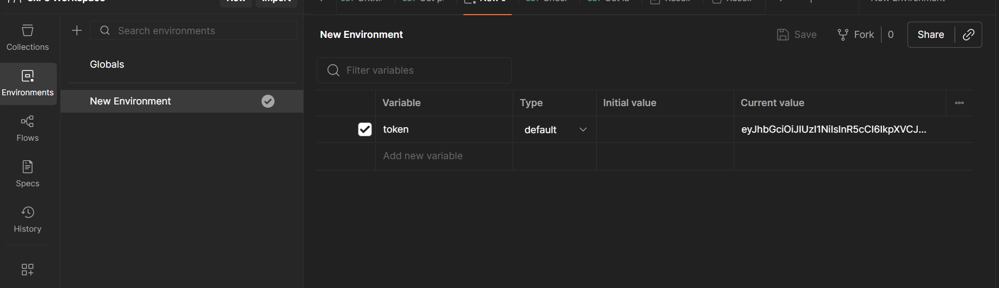

# Reselling Platform

API fora reselling platform where users can buy and sell goods

## Important Links

1. Live link - https://webdwing-task2.onrender.com/

2. API Docs (in YAML) - in IMPORTANT DOCUMENTS folder (apidocs.yaml)

3. Postman Collection - in IMPORTANT DOCUMENTS folder

4. ADR Document - in IMPORTANT DOCUMENTS folder

## Installation

1. Clone the repository

```
git clone https://github.com/Skr-suyash/webdwing-task2.git
```

2. Navigate to backend
```
cd backend
```

3. Install dependencies
```
npm i
```

4. Set up the environment variables
```
PORT = 3000

MONGO_URI = URI

ASSIGNMENT_SEED = GHW25-<unique>
```

5. Start the server
```
npm start
```

## Postman Collections Usage

1. Import the collections file in Postman

2. Register the user using the '/api/auth/register and login using the '/api/auth/login' and copy the JWT token

3. Go to environment variables section in Postman and set a variable token "token" to the one copied before 

